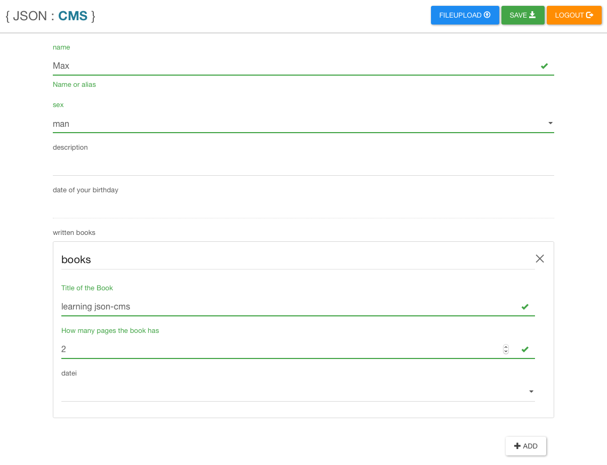

# JSON CMS

With json cms you can build your Webpages and get your Data from a single json File.
It is up to you if you want to use PHP or simple html with javascript for the Webpage, because the Content of your Webpage can be managed by JSON CMS.
It is the fastest way to create a simple Webpage with dynamic Content. There is no requirement for a Database.

## Json CMS UI



# How to use it?

You can download the zip file [JsonCMS.zip](https://github.com/illiano/jsoncms/raw/master/JsonCMS.zip) and use it or Just run composer install and then gulp dist to build the newest version of JSON CMS. You have to change the Admin Password in the "backend/index.php" File.
Now you can manipulate the "backend/schema.json" File for all kind of Data you need. The Schema has to be compatible with the [Json schema v4](http://json-schema.org/) Standard.

## example

"backend/index.php"

```php
    /*
        change the admin password here, 
        this password will allow you to change the content data
    */
    $password = "mySecretPassword";
```

"backend/schema.json"

```json

{
    "type": "object",
    "properties": {
        "name": {
            "type": "string",
            "minLength": 2,
            "description": "Name or alias"
        },
        "sex": {
            "type": "string",
            "enum": [
                "man",
                "woman"
            ]
        },
        "birthday": {
            "type": "string",
            "title": "date of your birthday",
            "format": "date"
        },
        "books": {
            "type": "array",
            "title": "written books",
            "items": {
                "type": "object",
                "properties": {
                    "title": {
                        "title": "Title of the Book",
                        "type": "string"
                    },
                    "pages": {
                        "type": "integer",
                        "title": "How many pages the book has"
                    }
                },
                "required": [
                    "title",
                    "pages"
                ]
            }
        }
    },
    "required": [
        "name",
        "sex",
        "bookings"
    ]
}

```

# DEVELOPER

## Available Scripts

In the project directory, you can run:

### `npm start`

Runs the app in the development mode.<br>
Open [http://localhost:3000](http://localhost:3000) to view it in the browser.

The page will reload if you make edits.<br>
You will also see any lint errors in the console.

### `npm test`

Launches the test runner in the interactive watch mode.<br>
See the section about [running tests](https://facebook.github.io/create-react-app/docs/running-tests) for more information.

### `npm run build`

Builds the app for production to the `build` folder.<br>
It correctly bundles React in production mode and optimizes the build for the best performance.

The build is minified and the filenames include the hashes.<br>
Your app is ready to be deployed!

See the section about [deployment](https://facebook.github.io/create-react-app/docs/deployment) for more information.

### `npm run eject`
